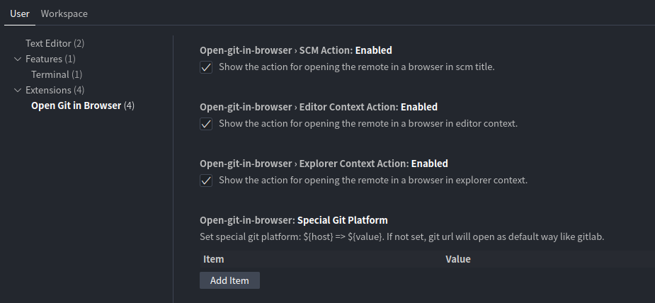

# open-git-in-browser

Open the current file the source control platform's web UI. This is useful for sharing perma-links with collaborators. Install via the [VSCode Marketplace](https://marketplace.visualstudio.com/items?itemName=newhoo.open-git-in-browser) or see [Installation Instructions](https://code.visualstudio.com/api/working-with-extensions/publishing-extension#packaging-extensions).

## Features

- Support most git platforms.
- Support current multi-line selection link.
- Support open more than one git remote in your browser.

Add Entries:

- Add `Open Git in Browser` to the Command Palette.
- Add context menu option to open the selected file in your browser.
- Add Git view menu option to open the it remote in your browser.

## Usage

- StatusBar / Explorer context / Scm menu (can select text in editor)

- Extension Settings

## Requirements

VSCode 1.85.0 or newer

## More

Encouraged by: [vscode-open-in-browser](https://github.com/andrei-m/vscode-open-in-browser)
